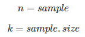
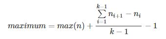
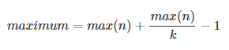

## Backstory
#### Hard times
During World War II, when the outcome was still unclear, Allies faced many intelligence challenges. One of them was later called “German Tank Problem” and made it into the history of statistics. The question was: how to estimate the total number of produced German tanks during years 1940-1942.

Most of the time Shermans were no match for German Panzers, so this information regarding enemy’s potential was crucial. According to estimations brought by spies, informants and  reconnaissance flights, there were whooping 1400 tanks produced a month. As it turned out, they were horribly wrong, what could have significant repercussions for Allies.

#### Fortunately, they had statisticians on board
While exploring German tanks wreckages, a pattern was spotted on spare parts’ serial numbers. Slowly, but surely, pattern unraveled and statisticians recognized that the it followed uniform discrete distribution (N = 1, 2, 3, 4, …). 

Once recognized, estimating total numbers of tanks produced started to be relatively easy. Uniform discrete distribution properties were well known back then, as the formula for the total number of tanks, alias the maximum of distribution:




```{r}
# LaTeX code:
# maximum = max(n) + \frac{\sum\limits_{i=1}^{k-1} n_{i+1} - n_i}{k-1} - 1
```
What could be understood intuitively as the sample maximum plus the average gap between observations in the sample or rewritten as:


```{r}
# LaTeX code:
# maximum = max(n) + max(n)/k - 1
```
We’ll try to recreate World War II statisticians’ effort in R.

## Let's get started

#### Libraries needed
```{r}
library(moments)
```

#### Clears environment, sets seed
```{r}
rm(list = ls())
seed = 1940
```

## Simple approach
#### Guess maximum function 
```{r}
guess_maximum <- function(sample_size, sample_maximum) {

  # discrete uniform distribution in R - without replacement 
  tank_factory_number <- sample(1:sample_maximum, sample_size, replace = FALSE)
  tank_factory_number <- sort(tank_factory_number)
  
  # calls empty numeric vector
  differences <- numeric()
  
  # gets the differences between samples
  for (i in 1:(length(tank_factory_number) - 1)) {
    differences[i] = (tank_factory_number[i + 1] - tank_factory_number[i])
    #print(tank_factory_number[i+1] - tank_factory_number[i]) #helpful for debugging a loop
  }
  
  # obtains predicted maximum
  guessed_max <- max(tank_factory_number) + sum(differences)/length(differences) - 1
  return(guessed_max)
}
```
Let's assume that we know the distribution already and destroyed 50 tanks with serial numbers.
Total number of tanks that we're trying to guess is 500.
```{r}
guess_maximum(sample_size = 50, sample_maximum = 500)
```
Not so far from known maximum. Now, let's harden the task with assumption that we found only 5 tanks out of 500 produced:
```{r}
guess_maximum(sample_size = 5, sample_maximum = 500)
```
Even with a small fraction of tanks, we're able to estimate tanks number with considerably small error which is at least an order of magnitude more precise than the intelligence estimates.

## Simulation approach

First results are very close to the real maximum - in this section we'll try this approach in simulation environment to check if the estimated maximum averaged over numerous simulations converges to real value.

#### Guess maximum function with simulation loop
```{r}
guess_maximum_simulation <- function(sample_size, sample_maximum) {
  
  # calls empty numeric vector for single estimates
  guessed_max <- numeric()

  # run simulation loop
  for (j in 1:10000) {
    
    # discrete uniform distribution in R
    tank_factory_number <- sample(1:sample_maximum, sample_size, replace = FALSE)
    tank_factory_number <- sort(tank_factory_number)
    
    # calls empty numeric vector
    differences <- numeric()
    
    # gets the differences between samples
    for (i in 1:(length(tank_factory_number) - 1)) {
      differences[i] = (tank_factory_number[i + 1] - tank_factory_number[i])
      #print(b[i + 1] - b[i]) #useful for debugging
    }
    
    # stores estimated values in vector
    guessed_max[j] <- max(tank_factory_number) + sum(differences)/length(differences) - 1
  }
  
  # obtains predicted maximum
  avg_guessed_max <- sum(guessed_max)/length(guessed_max)
  return(avg_guessed_max)
}
```

Let's assume that we know the distribution already and destroyed 50 tanks with numbers.
Total number of tanks that we're trying to guess is 500.
```{r}
guess_maximum_simulation(sample_size = 50, sample_maximum = 500)
```
The precision here is astonishingly good. Now, let's recreate it again, under the scarce information conditions:
```{r}
guess_maximum_simulation(sample_size = 5, sample_maximum = 500)
```

Even in case of dataset with scarce, the averaged result is very precise. That proves robustness of this method - in theoretical situation with 10 000 sets of samples.

#### Density plot 

Guess maximum function redefined to output vector of single estimates
```{r}
guess_maximum_simulation_n <- function(sample_size, sample_maximum) {
  
  # calls empty numeric vector for single estimates
  guessed_max <- numeric()

  # run simulation loop
  for (j in 1:10000) {
    
    # discrete uniform distribution in R
    tank_factory_number <- sample(1:sample_maximum, sample_size, replace = FALSE)
    tank_factory_number <- sort(tank_factory_number)
    
    # calls empty numeric vector
    differences <- numeric()
    
    # gets the differences between samples
    for (i in 1:(length(tank_factory_number) - 1)) {
      differences[i] = (tank_factory_number[i + 1] - tank_factory_number[i])
      #print(b[i + 1] - b[i]) #for debugging
    }
    
    # stores estimated values in vector
    guessed_max[j] <- max(tank_factory_number) + sum(differences)/length(differences) - 1
  }
  
  # obtains vector of predicted values
  guessed_max <- guessed_max
  return(guessed_max)
}
```

Vector of 1000 estimates with sample = 200 each
```{r}
sample_200 <- guess_maximum_simulation_n(sample_size = 200, sample_maximum = 500)
```

Vector of 1000 estimates with sample = 50 each
```{r}
sample_50 <- guess_maximum_simulation_n(sample_size = 50, sample_maximum = 500)
```

Vector of 1000 estimates with sample = 5 each
```{r}
sample_5 <- guess_maximum_simulation_n(sample_size = 5, sample_maximum = 500)
```

Simulation results plotted in histogram / density plots for further investigation
```{r}
hist(sample_200, breaks = 12, col = "red")
hist(sample_50, breaks = 12, col = "red")
hist(sample_5, breaks = 12, col = "red")
```

As you can see, the density plot is highly skewed to the left (negatively)
```{r}
skewness(sample_50)
```
```{r}
kurtosis(sample_50)
```

## Conclusion
This approach to estimation the maxiumum of sample was proved to be a robust and replicable one. It was once again used during World War II with estimating a total number of V2 rockets. After WWII this kind of analysis were used also during Korean War or even while estimating total number of Commodore 64 computers built. 

You can find out more on German Tank Problem in Wikipedia: https://en.wikipedia.org/wiki/German_tank_problem . 